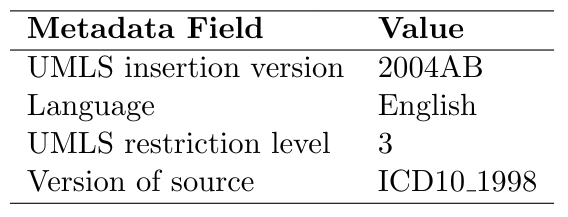
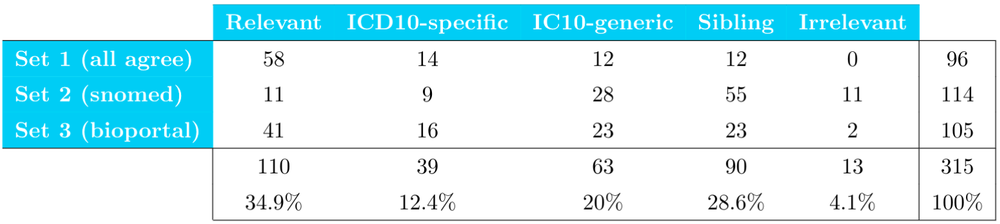
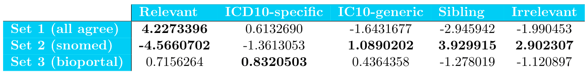

---?color=white
@title[Introduction]

@snap[west text-white span-80]
@box[bg-blue](Dimitris Nikolopoulos # Connecting patient groups to biomedical research: a Linked Data approach using ICD10 and PubMed)
@snapend

@snap[south-east byline text-black text-06]
Vrije Universiteit Amsterdam 
Artificial Intelligence 2nd KIM presentation 
Supervised by Prof. Annette ten Teije
@snapend

---?color=linear-gradient(100deg, #fff1eb 50%, #4487F2 50%)
@title[Outline]

@snap[west text-center text-14 text-bold text-italic text-black  span-50]
Outline
@snapend

@snap[east text-center text-white span-45]
@ol[split-screen-list text-09](false)
- Context & Use Case
- Research Framework
<!-- - Some Preliminaries -->
- Methods
- Results & Analysis
- Discussion

@olend
@snapend

---?color=linear-gradient(135deg, #fff1eb, #ffffff)

@title[Context & Use Case]

## @color[black](Context & Use Case)
@fa[arrow-down text-black]

+++?image=template/img/bg/c1.jpg&position=center&size=100% 65%
@snap[south-east template-note text-black]
Context & use case (1/7)
@snapend

@title[Domain and Problem Statement]

@snap[north span-100]
@size[1.5em](Domain and problem area)
@snapend

@snap[west list-content-verbose  span-100]
@ul[list-bullets-blue]
- **Domain:** Health/patient care in combination to biomedical research
- **Problem:** Correlating patient groups to research output of academic hospitals
- A task that requires **knowledge** and **knowledge intensive processes**
@olend
  
@snapend

+++?color=linear-gradient(90deg, #ffffff 50%, #4487F2 50%)
@title[Text + Image Centered]
@snap[south-east template-note text-black]
Context & use case (2/7)
@snapend

@snap[north-west span-40 text-center]
@color[#text-black](@size[1em](<u>Knowledge</u>))
@snapend

@snap[west list-content-verbose span-40]
 
@ul[text-black]
- Electronic Health Records (EHRs)
- Medical Classification Systems
- Databases with academic and scientific articles
- Controlled vocabularies
@ulend
@snapend

@snap[midpoint]
@box[bg-white mid-box rounded](@fa[user-injured fa-blue] @fa[sync-alt fa-blue] @fa[newspaper fa-blue])
@snapend

@snap[north-east span-40 text-black text-center]
@size[1em](<u>Knowledge Intensive Procedures</u>)
@snapendf

@snap[east list-content-verbose span-40]
 
@ul[text-black]
- Retrieving articles/patient-groups of interest
- Grouping articles or patient-groups
- Linking topics of articles to diagnosis codes
- Getting insights / evaluating
@ulend
@snapend

+++?image=template/img/bg/c1.jpg&position=bottom&size=100% 75%
@title[Use Case]
@snap[north span-100]
@size[1.7em](Use Case)

@snap[fragment]
@snap[span-80]
  
#### University Medical Centres (UMCs)
@snapend

@snap[east span-20]
    

@snapend
@snapend
@snapend

@snap[south-west text-center span-30 fragment]
@size[0.7em](**Bridging three scopes**)

@snapend

@snap[south span-30 text-center fragment]
@size[0.7em](**Citation scores above the world average**)

 
@size[0.4em](Source: <a href="https://www.rathenau.nl/en/science-figures/output/publications/citation-impact-score-dutch-universities" >Rathenau Instituut</a>)
@snapend

@snap[south-east text-center span-33 list-content-concise text-08 fragment]
@size[1.3em](**ROBIJN project**)
@ul
  - Objective linking between "academic" patients and scientific output.
@ulend
  
@snapend

+++?image=template/img/bg/c1.jpg&position=center&size=100% 65%
@title[Opportunity]
@snap[north span-100]
@size[1.5em](Opportunity)
@snapend

@snap[midpoint list-content-verbose span-100]
@ul[list-bullets-black](false)
- Knowledge Representation & Reasoning
- Implementation through **Knowledge Based Systems**
- Representation of domain knowledge: **Ontologies**
- Reasoning with **Semantic Web** tools
@ulend
  
@snapend

+++
@title[Interoperability Problem]
@snap[north span-100]
@size[1.5em](Interoperability Problem)
@snapend

@snap[west list-content-verbose span-100]
@ul[list-bullets-black](false)
- Various Disease Ontologies
  - Different content, focus, granularity
  - Different purpose, e.g: for statistics, retrieval, patient reports...
@snap[fragment]
- Considering community-based mapping efforts such as:
@snapend
@olend
  
@snapend

@snap[fragment]
@snap[south-west span-33]

@snapend

@snap[south span-33]

@snapend

@snap[south-east span-33]

@snapend

+++?image=template/img/bg/c1.jpg&position=center&size=100% 65%
@title[Knowledge sources]
@snap[north span-100]
@size[1.5em](Knowledge sources)
@snapend

@snap[west text-center span-50 text-08]
<u>ICD10</u>   

@ul[list-bullets-black text-08](false)

- International Classification of Diseases - 10th revision
- Reporting diagnosis codes for patients.
- Monohierarchical Tree Structure
- Statistical classification system:
  - Mutually exclusive nodes
  - Exhaustive
  - Residual categories
@ulend

@snapend

@snap[east text-center fragment text-08 span-50]
<u>MeSH</u>  

@ul[list-bullets-black text-08](false)

- Medical Subject Headings
- Controlled vocabulary created by NLM.
- Hierarchical terminology for indexing biomedical info
- Indexing of MEDLINE citations
- MEDLINE is accessed by **PubMed**:
    - database, search engine for biomedical articles
    - over 29 million citations
@ulend
@snapend

+++
@title[Semantic Web technologies]
@snap[north span-100]
@size[1.5em](Semantic Web technologies)
@snapend

@snap[west text-center text-black span-80]
@ol[split-screen-list text-06](false)
- Ontology representation based on **RDF**.  

- Ontology creation based on **Linked Data** principles.  
- Querying through **SPARQL**.  
@olend
@snapend

@snap[south-west span-10]

@snapend

@snap[south span-53]

@snapend

@snap[south-east span-23]

@snapend

---?color=linear-gradient(135deg, #fff1eb, #ffffff)

@title[Research Framework]

## @color[black](Research Framework)
@fa[arrow-down text-black]

+++

@title[Main points]
@snap[north span-100]
@size[1.5em](Main points)
@snapend

@snap[west text-center text-black span-80]
@ol[split-screen-list text-06](false)
- **Problem:** correlation between patient groups and articles.
- **Motivation:** Dutch UMC case.
- **Approach:** Knowledge Engineering using Linked Data methods and tools.

@olend
@snapend

+++?color=linear-gradient(135deg, #ffffff, #4487F2)
@title[Main Research Question]

@snap[midpoint span-100]
@box[bg-white text-center text-09 box-wide-padding](Main Research Question # How can we investigate the correlation between patient groups and academic articles by following a Knowledge Engineering approach using Semantic Web technologies?)
@snapend

+++?color=linear-gradient(135deg, #ffffff, #4487F2)
@title[First Subquestion]

@snap[midpoint span-100]
@box[bg-white text-center text-09 box-wide-padding](1st Sub-question # How the **domain knowledge** about:   (1) health conditions describing patient groups with _ICD10_,   (2) topics about diseases in academic articles of _PubMed_, and   (3) _mappings_ between them,    can be gathered, created if necessary, and be represented?)
@snapend

+++?color=linear-gradient(135deg, #ffffff, #4487F2)
@title[Second Subquestion]

@snap[midpoint text-09 span-100]
@box[bg-white text-center text-09 box-wide-padding](2nd Sub-question # What is the quality of the potential mappings between ICD10 and MeSH, in terms of relevance and distribution within the various sources?)
@snapend

+++?color=linear-gradient(135deg, #ffffff, #4487F2)
@title[Third Subquestion]

@snap[midpoint text-09 span-100]
@box[bg-white text-center text-09 box-wide-padding](3rd Sub-question # How can the Semantic Web technology of SPARQL be used for obtaining interesting insights about the patient groups and articles of a specific UMC?)
@snapend

---?color=linear-gradient(135deg, #fff1eb, #ffffff)

@title[Methods]

## @color[black](Methods)
@fa[arrow-down text-black]

+++
@title[Knowledge Model]
@snap[north text-12]
Knowledge Model  
@snapend

@snap[west  span-100]
Identify knowledge and reasoning features:  
@ol[list-content-verbose](false)
- Task knowledge: decomposing the task into inferences
- Inference knowledge: modeling the main inference procedures
- Domain knowledge: representing domain knowledge and knowledge base
@olend
  
@snapend

+++
@title[Task Knowledge]
@snap[north text-12]
Task Knowledge
@snapend

@snap[midpoint span-80]

@snapend

+++
@title[Inference Knowledge]
@snap[north text-12]
Inference Knowledge
@snapend

@snap[west span-50]

@snapend

@snap[east span-50 fragment]

@snapend

+++
@title[Domain Knowledge]
@snap[north text-12]
Domain Knowledge
@snapend

@snap[midpoint span-80 fragment]

@snapend

+++
@title[RDF graph aggregation]
@snap[north text-12 span-60]
Domain: aggregation of RDF graphs
@snapend

@snap[west  span-100]
@ol[list-content-verbose]
- **ICD10:** BioPortal
- **MeSH:** BioPortal
- **PubMed:** no maintained version
- **Mappings:** BioPortal and SNOMED-CT mapping tool
@olend
@snapend

+++?color=linear-gradient(90deg, #ffffff 50% , #4487F2 50%)
@title[BioPortal MeSH and ICD10]

@snap[east fragment span-40]
#### MeSH

@size[0.9em](**8.699.638** statements)  
@size[0.5em](<u>Metadata</u>)
  

@size[0.5em](<u>Some statistics</u>)

@snapend

@snap[west span-35]
#### ICD10

@size[0.9em](**85.597** statements)  
@size[0.5em](<u>Metadata</u>)
  

@size[0.5em](<u>Some statistics</u>)

@snapend

+++
@title[PubMed]
@snap[north text-12]
PubMed
@snapend

@snap[west text-black text-08]
Some projects: 
@ul
  - **bio2rdf** (PubMed not included in latest versions)
  - **Biotea** (PubMed Central, No MeSH terms)
@ulend  
 
 

@ul
- XML release by NLM each December
- Updates on a daily basis
- Extract-Transform-Load into Linked Data
- Baseline: **2018**
@ulend
@snapend

+++
@title[PubMed as XML]
@snap[north text-12 span-100]
PubMed as XML   

@code[xml code-wrap text-08  code-reveal-fast](src/xml/example.xml)

@[1-13](MEDLINE citation info)
@[15-27](Journal Info)
@[40-48](Author list)
@[90-100](MeSH Headings)
@[136-160](PubMed Data)
@snapend

+++
@title[PubMed Domain Schema]

@snap[west text-white text-08]
@box[bg-blue](PubMed Domain Schema)
@snapend

@snap[east span-80]

+++
@title[RDFizing PubMed]

@snap[north text-black ]
RDF-izing PubMed  
@snapend
@snap[west list-content-concise text-black text-08]
@ul[]
- Create schema and keep in separate graph (Protege).
- Transform XML files into RDF (Python-RDFLib):
  - Use **HTTPS IRIs** (temporary solution: https://example.org/id/<an-id>)
  - Create **unique resource IRIS** based on hashing resource attributes.
  - Use IRIS, **instead of blank nodes** wherever possible.
  - Assign **classes** to all resources.
  - Assign proper **datatypes**, especially dates.
  - **Data validation** (Python-Cerberus)
  - **Annotations**
  - Link MeSH resources of Pubmed to **MeSH**.
@ulend
@snapend

+++
@title[PubMed as RDF]

@snap[midpoint text-black span-100]
PubMed as RDF  
@code[rdf text-07 code-reveal-fast](src/rdf/example.ttl)

@[1-4](Prefixes)
@[1-13](Article information)
@[14-24](MeSH Heading)
@[25-32](Author and affiliation information)
@[35-38](Publication Date of Issue)
@snapend

+++
@title[PubMed 2018 in numbers]

@snap[north text-black]
PubMed in Numbers
@snapend

@snap[midpoint text-07 span-90]

**Total number of triples:** ~1.8B (plus ~1.5K in vocabulary)
  
@table[table-header](assets/csv/pubmed.csv)
@snapend

@snap[fragment south-east template-note text-orange]
Create RDF subsets to optimize querying!
@snapend

+++
@title[Subset: Radboud UMC]
@snap[north text-black]
Subset: Radboud UMC
@snapend

@snap[midpoint]
@ul[text-07](false)
- An RDF graph subset based on authors' affiliations.
- Regular expression string provided by PubMed expert:  
@ulend
@snap[text-05]
@code[text](assets/files/string.txt)
@snapend
 
@ul[text-07](false)
- Only articles and mesh headings links in the graphs:
**id:&lt;article>  vocab:hasMeshHeading id:&lt;heading>**  
- **Total number of triples:** ~370K
- **Total number of articles found:** 23.745

@ulend
@snapend

+++
@title[Community Based Mappings]
@snap[north text-12 span-80]
Community Based Mappings
@snapend

@snap[west list-content-verbose span-70]
@ol[list-bullets-black]
- **UMLS**  @fa[arrow-right] A frame-based Classification
- **BioPortal** @fa[arrow-right] A _REST API_ for retrieving UMLS-based and string-based (LOOM) mappings
- **SNOMED-CT Mapping tool** @fa[arrow-right] Mappings between ICD10CM and SNOMEDCT
@olend
  
@snapend

@snap[east span-30]

@snapend

+++?color=linear-gradient(90deg, #fff1eb 50%, #4487F2 50%)
@title[Source: Mappings]

@snap[west list-content-verbose span-50]
BioPortal-2018AA  
@ol[list-bullets-black text-07](false)
- **Source 1:** MeSH @fa[arrows-h] ICD10  &nbsp;&nbsp;&nbsp;&nbsp;&nbsp;&nbsp;&nbsp;&nbsp;- 2.263 mappings

- **Source 2:** MeSH @fa[arrows-h] ICD10CM @fa[arrows-h] ICD10  &nbsp;&nbsp;&nbsp;&nbsp;&nbsp;&nbsp;&nbsp;&nbsp;- 2.949 mappings
- **Source 3:** MeSH @fa[arrows-h] SNOMED @fa[arrows-h] ICD10  &nbsp;&nbsp;&nbsp;&nbsp;&nbsp;&nbsp;&nbsp;&nbsp;- 2.366 mappings
@olend
@snapend

@snap[east list-content-concise fragment span-50]
SNOMED-CT mapping tool  

@ul[list-bullets-black text-07](false)
- Mappings between SNOMED and ICD10CM
- All mappings are in a file that can be accessed with the UMLS or SNOMED License.
- Version: March 2018 (same as with BioPortal)
- Only **1-to-1** mappings considered: - &nbsp;&nbsp;&nbsp;&nbsp;&nbsp;&nbsp;&nbsp;&nbsp;78.954 mappings - &nbsp;&nbsp;&nbsp;&nbsp;&nbsp;&nbsp;&nbsp;&nbsp; **4205** mappings with BioPortal
@ulend
@snapend
@snap[south-west fragment span-50]
@box[bg-green span-90](Union total: **5.699** mappings)
@snapend

+++
@title[Mapping evaluation]
@snap[north text-12]
Mapping evaluation
@snapend

@snap[west list-content-concise text-08 span-100]
Consider 3 categories of mappings:  
@ol[text-08](false)
- Mappings achieved by all methods.
- Mappings achieved only by SNOMED-CT mapping tool.
- Mappings achieved only by BioPortal methods.

@olend
 
 
@ul[text-08](false)
- Large enough samples. 
- Expert evaluation on a subset (**315** random mappings)
- **χ2 test of homogeneity** on results.
@ulend
@snapend

---?color=linear-gradient(135deg, #fff1eb, #ffffff)

@title[Analysis]

## @color[black](Results & Analysis)
@fa[arrow-down text-black]

+++
@title[subquestion 1]
@snap[midpoint  text-left span-100]
@box[bg-blue text-08 text-left text-white](Sub-question 1 (**domain knowledge representation**) # <ol style="padding-left:20px"><li> **Patient groups** - BioPortal ICD10  </li><li>**Publication & Topics** - Generated RDF graph of PubMed / BioPortal MeSH  </li><li>**Mappings** - BioPortal & SNOMED-CT</li></ol>  )
@snapend

+++
@title[subquestion 2]
@snap[midpoint  text-left span-100]
@box[bg-blue text-08 text-left text-white](Sub-question 2 (**mapping distribution and quality**) # <ol style="padding-left:20px"><li>**Expert evaluation**  </li><li>**Test of homogeneity**  </li><li>**What are the deviations from homogeneity?**  </li></ol>  )
@snapend

+++

@snap[midpoint list-content-verbose  span-100]
5 quality labels:  
@ol
- **Relevant**
- **ICD10-Specific**
- **ICD10-Generic**
- **Sibling**
- **Irrelevant**
@olend
@snapend

+++
@snap[north span-100]
Chi2 test of homogeneity.
@snap[text-left text-07]
  
H0: The distributions of the evaluations within the 3 sources are the same.
@snapend
@snapend
@snap[midpoint fragment span-100]
   

@snap[fragment]
@size[0.5em](80% expected values is < 5 @fa[arrow-right] simulated p-value α=0.05, p-value= <b>0.0004998</b>. For 5% level of significance, there is significant evidence that the distribution is not the same amongst the 3 sources.)
@snapend
@snapend

+++
@snap[north span-100]
Deviations from homogeneity
@snap[text-left text-07]
  
Look at the contribution of each entry of the table to the test statistic:  
@snap[text-08]
`\[
  \frac{x - x_{expected}} {\sqrt {x_{expected}}}
\]`
@snapend
@snapend
@snapend
@snap[fragment midpoint span-100]
  

 
@snapend
+++
@title[subquestion 3]
@snap[midpoint  text-left span-100]
@box[bg-blue text-08 text-left text-white](Sub-question 3 (**using SPARQL**) # Let's see two tasks  )

@snapend
+++
@title[TASK1]
@snap[midpoint span-100 text-left]

### <u>Task 1</u> 
Map all articles with:  
@ol[text-09](false)
- at least one author affiliated to **RadboudUMC**,
- publication date within the years **2015-17**, and
- indexed MeSH of specific categories **{C, D, E, F, N}**
@olend
  to ICD10 codes (patient groups).
  
**Inferences:** filter articles, group by MeSH, map
@snapend

+++
@title[SPARQL TASK1]
@code[xml text-black code-wrap code-reveal-fast text-06](src/sparql/query.rq)

@[1-8, zoom-15](Prefixes)
@[10, zoom-14](Pair selection)
@[11-14, zoom-18](Select all Radboud articles with their MeSH headings.)
@[15-22, zoom-14](Filter by years of publication)
@[23-26, zoom-18](Get PMIDs, and MeSH UIs - [group])
@[29-33, zoom-15](Filter by specific MeSH tree categories)
@[35-37, zoom-18](Get mappings)
@[39-42, zoom-18](Use notation and label of ICD10 for readability)
@[44-45, zoom-18](Order and limit)

+++?color=linear-gradient(135deg, #fff1eb, #4487F2)
@title[Task results]

Task Results: PubMed to ICD10

+++
@title[TASK2]
@snap[midpoint span-100 text-left]

### <u>Task 2</u> 
Map patient groups from the ICD10 code C81 [Hodgin's Disease] including all the subclasses [C81.0-C81.9], to PubMed articles (with same filters as before).
  
**Inferences:** filter patient groups, group by C81, map
@snapend

+++
@title[SPARQL TASK2]
@code[xml text-black code-wrap span-80  text-06](src/sparql/query2.rq)

@[10, zoom-18](Pmid selection - assuming all mapped to C81)
@[39-41, zoom-18](Use notation of ICD10 for readability)

@snap[midpoint template-note fragment text-black]
@size[1.8em](**35 publications falling into C81**)
@snapend

+++
## Some insights

+++?color=linear-gradient(90deg, #fff1eb 30%, #4487F2 70%)
@title[Top-50 ICD10]
@snap[west text-07 span-20]
Top-50 patient groups covered in research by Radboud UMC for 2015-17
@snapend
@snap[east span-80]

@snapend

+++
@snap[north span-100 text-08]
Research output per disease group (Radboud 2015-17)
@snapend
@snap[west span-50]

@snapend

@snap[east span-50]

@snapend

+++
@snap[north-west span-50 text-08]
Scatterplot - 61 patient groups and publications for all evaluated mappings
@snapend
@snap[south-west span-50 text-06]

  
Spearman Correlation Test: correlation=0.0217, pvalue=0.8678 

@snapend

@snap[fragment]
@snap[north-east span-50 text-08]
Scatterplot - 61 patient groups and publications for Relevant mappings
@snapend
@snap[south-east span-50 text-06]

  
Spearman Correlation Test: correlation=0.12017, p-value=0.356 

@snapend
@snapend

---?color=linear-gradient(135deg, #fff1eb, #ffffff)
@title[Discussion]

## @color[black](Discussion)
@fa[arrow-down text-black]

+++?color=linear-gradient(135deg, #fff1eb, #ffffff)

## Important outcomes
@ol[split-screen-list text-09](false)
- Gathered required knowledge in a single place
- PubMed in RDF
- SPARQL expression power for getting insights
@olend
@snapend

+++?color=linear-gradient(135deg, #fff1eb, #ffffff)
## Limitations
@ol[split-screen-list text-09](false)
- Correctness of ontologies, e.g. ICD10 was missing some hierarchies.
- Mappings do not necessarily show synonymity.
- SPARQL query timeouts (use of ASK queries?)
@olend
@snapend

+++?color=linear-gradient(135deg, #fff1eb, #ffffff)

@title[Next?]

@snap[midpoint text-center text-black span-100]

## Future Work
@ol[split-screen-list text-09](false)
- A solid up-to-date triplestore system
- Mapping evaluation techniques
- Market share throughout UMCs
@olend
@snapend

---
@title[References]
### References
@ul[text-05](false)
- van de Laar, L., de Kruif, T., Waltman, L., Meijer, I., Gupta, A., & Hagenaars, N. (2018). Improving the evaluation of worldwide biomedical research output: classification method and standardised bibliometric indicators by disease. BMJ open, 8(6), e020818.
- Castro, L. J. G., McLaughlin, C., & Garcia, A. (2013, April). Biotea: RDFizing PubMed Central in support for the paper as an interface to the Web of Data. In Journal of biomedical semantics (Vol. 4, No. 1, p. S5). BioMed Central.
- Yang, H., Robinson, P. N., & Wang, K. (2015). Phenolyzer: phenotype-based prioritization of candidate genes for human diseases. Nature methods, 12(9), 841.
- Salvadores, M., Horridge, M., Alexander, P. R., Fergerson, R. W., Musen, M. A., & Noy, N. F. (2012, November). Using sparql to query bioportal ontologies and metadata. In International Semantic Web Conference (pp. 180-195). Springer, Berlin, Heidelberg.
- Haendel, M. A., McMurry, J. A., Relevo, R., Mungall, C. J., Robinson, P. N., & Chute, C. G. (2018). A census of disease ontologies. Annual Review of Biomedical Data Science, 1, 305-331.
- Noy, N. F., Griffith, N., & Musen, M. A. (2008, October). Collecting community-based mappings in an ontology repository. In International Semantic Web Conference (pp. 371-386). Springer, Berlin, Heidelberg.
- Merabti, T., Joubert, M., Lecroq, T., Rath, A., & Darmoni, S. J. (2010). Mapping biomedical terminologies using natural language processing tools and UMLS: mapping the Orphanet thesaurus to the MeSH. Irbm, 31(4), 221-225.
- Cardillo, E. (2015). Mapping between international medical terminologies.
@ulend

---
@title[Questions]

@snap[east span-50]

@snapend

@snap[south-west template-note text-gray]
contact: d.nikolopoulos@vu.nl
@snapend
