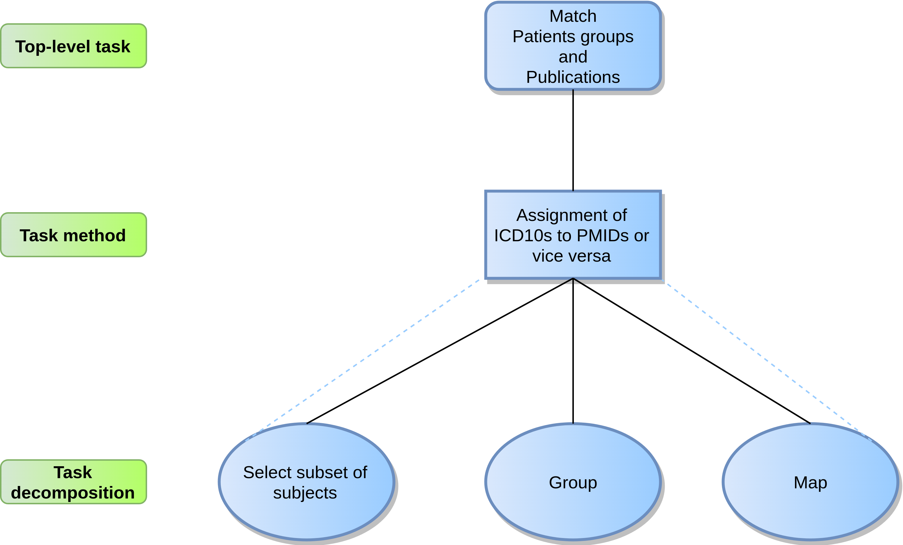

@snap[midpoint span-100]
#### Connecting patient groups and related articles: a Knowledge Engineering approach
@snapend

+++?color=linear-gradient(90deg, white 50%, black 50%)

@snap[west span-50 text-center]
### GRAPHQL
@fa[quote-left](The task knowledge)

@snapend

@snap[north-east span-40 text-08]
@box[bg-green](Top--level task task # matching the subjects)
@snapend

@snap[east span-40 text-08]
@box[bg-blue](Task method  # Assignment)
@snapend

@snap[south-east span-40 text-08]
@box[bg-gold](Inferences #three of them)
@snapend

---?color=linear-gradient(180deg, white 50%, #E71E60 50%)

@snap[north span-40 h3-black]
### GRAPHQL
@fa[quote-left quote-graphql](A query language)
@snapend

@snap[south span-85 fragment]
@code[sql zoom-11 code-power code-shadow](src/sparql/query.rq)
@snapend

+++

@code[sql code-reveal-fast code-power code-blend](src/sparql/query.rq)

@snap[south span-100 text-08]
@[1-2](Prefixes)
@[3-7](Body)
@[1,5-6](Hmm)
@snapend
